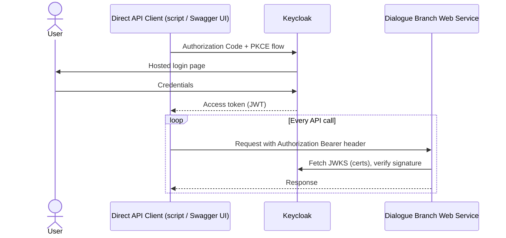
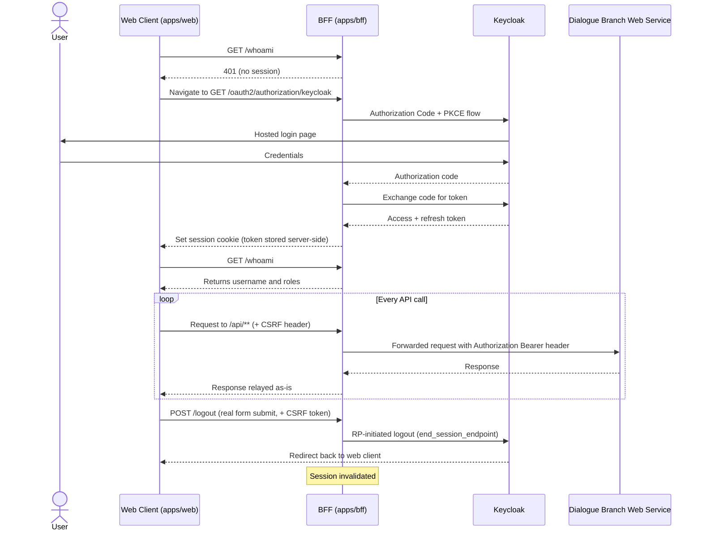

# Dialogue Branch Web Services: Authentication

## Overview

::: info Note
Development of the Dialogue Branch Platform (including the Web Service) occurs on the [main](https://github.com/dialoguebranch/platform/tree/main) branch of the monorepo. For stable software versions, check out the [release tags](https://github.com/dialoguebranch/platform/releases).
:::

The Dialogue Branch Web Service is a pure [OAuth2](https://oauth.net/2/) **resource server**: it validates Bearer tokens issued by [Keycloak](https://www.keycloak.org/), an open source Identity and Access Management platform, but plays no role in issuing, refreshing, or otherwise managing tokens itself. There is no `/auth/login` end-point, and no built-in username/password store — all user management happens in Keycloak.

There are two distinct ways a client ends up presenting a valid token to the Web Service, depending on what kind of client it is:

* A **direct API client** (a custom integration, a script, or the bundled Swagger UI) performs the OAuth2 flow itself and attaches the resulting access token to every request — see [Direct API Clients](#direct-api-clients) below.
* The **reference web client** (`apps/web`) never performs the OAuth2 flow itself and never holds a token at all. It delegates authentication entirely to a separate Backend-for-Frontend service (`apps/bff`) that sits in front of the Web Service — see [Web Client Authentication (via the BFF)](#web-client-authentication-via-the-bff) below.

## Direct API Clients

A client application authenticates a user directly with Keycloak, using the [Authorization Code + PKCE](https://datatracker.ietf.org/doc/html/rfc7636) flow, against the realm and client configured on the Web Service deployment (by default, realm `dialoguebranch`, client id `dlb-web-service`, a public client). Once Keycloak returns an access token, the client includes it on every call to the Web Service:

```text
Authorization: Bearer <access-token>
```

The Web Service validates this token by fetching Keycloak's JSON Web Key Set (JWKS) at `{keycloak.baseUrl}realms/{keycloak.realm}/protocol/openid-connect/certs` and verifying the token's signature — it never contacts Keycloak's token end-point itself. The Swagger UI bundled with the Web Service is itself configured as an OAuth2 client (with PKCE) against the same Keycloak realm, so you can authenticate directly from the "Authorize" button on the Swagger page without writing any client code — see [Tutorial: Web Service - Exploring the API](/tutorials/webservice-exploringapi).



## Web Client Authentication (via the BFF)

`apps/bff` is a small Spring Boot [Backend-for-Frontend](https://samnewman.io/patterns/architecture/bff/) service that sits between the reference web client (`apps/web`) and the Web Service. It exists so that the browser never has to hold an OAuth2 access or refresh token: the token lives server-side, in the BFF's HTTP session, and the browser only ever holds a `JSESSIONID` session cookie.

The flow:

1. The web client sends the browser to the BFF's `GET /oauth2/authorization/keycloak` end-point (a real top-level navigation, not a fetch/XHR call). The BFF performs the Authorization Code + PKCE exchange against Keycloak itself and stores the resulting access/refresh token in the browser's HTTP session.
2. After login, the web client calls `GET /whoami` on the BFF to learn who's logged in. The BFF decodes the session's access token server-side and returns `{ "username": ..., "roles": [...] }` — the same `preferred_username` and `resource_access` → `dlb-web-service` → `roles` claims described under [Roles](#roles) below, just read out on the server instead of in the browser.
3. Every Web Service call the web client makes goes to the BFF's `/api/**` end-point instead of the Web Service directly. The BFF proxies the request through, attaching the session's access token as the `Authorization: Bearer` header itself. `GET /api/v1/info/all` is the one path the BFF forwards without a session at all, matching the Web Service's own public `/info/all` end-point (used by the web client's pre-login reachability check).
4. Token refresh happens transparently inside the BFF (via Spring Security's `OAuth2AuthorizedClientManager`) — the web client never sees or handles a refresh token.
5. Logging out is a `POST /logout` to the BFF (a real form submission, not a fetch — required both to satisfy Spring Security's default `LogoutFilter` matcher and so cookies survive the redirect to Keycloak's own logout page). This is *RP-initiated logout*: it ends both the BFF's session and the underlying Keycloak SSO session.
6. State-changing requests (anything but `GET`/`HEAD`/`OPTIONS`/`TRACE`) must carry an `X-XSRF-TOKEN` header matching the `XSRF-TOKEN` cookie the BFF sets — the standard CSRF protection recipe for cookie-authenticated SPAs.

Because the BFF only relays Bearer tokens it already obtained, the Web Service itself is completely unaware of its existence — from the Web Service's point of view, calls arriving via the BFF look identical to calls from any other direct API client.



## Roles

Once a token is validated, the Web Service reads the caller's username from the JWT's `preferred_username` claim, and their roles from the JWT's `resource_access` → `dlb-web-service` → `roles` claim — i.e. **client roles** configured on the `dlb-web-service` client in Keycloak (not Keycloak realm roles). Three roles are recognised:

* `participant` — may execute dialogues (`/dialogue/*`) and read/write their own Dialogue Branch Variables (`/variables/*`).
* `editor` — everything `participant` can do, plus authoring and publishing dialogue content (`/authoring/*`, `/publish/*`, `/draft/*`) and listing dialogues in a project (`/dialogue/list-dialogues`).
* `admin` — everything `editor` can do, plus managing projects (`/project/*`), and acting *on behalf of* another user by passing the optional `delegateUser` parameter present on most end-points.

Each end-point declares the minimum set of roles it accepts; calling with insufficient privileges results in a `401 Unauthorized` response with error code `INSUFFICIENT_PRIVILEGES`.

## Public End-Points

A small number of Web Service end-points do not require a token at all:

* `/info/all` — basic service information (build time, protocol version, service version, uptime).
* `/swagger-ui/**`, `/v3/api-docs/**` — the Swagger UI and its OpenAPI document.
* `/actuator/health`, `/actuator/info` — Spring Boot Actuator health/info endpoints.

Every other Web Service end-point requires a valid Bearer token. The BFF mirrors this for the one path the web client needs before login: its own `GET /api/v1/info/all` and `/actuator/health/**` are reachable without a session; every other BFF end-point (`/api/**`, `/whoami`) requires one, returning a plain `401` (rather than redirecting to Keycloak) for unauthenticated fetch/XHR calls.

## Local Development

When running the platform's local development stack (see the repository's top-level `infrastructure/docker/compose.yml`), Keycloak is available at `http://localhost:8081`. The bundled realm import does not seed any demo users — after starting the stack, log in to the Keycloak admin console (default credentials `admin`/`admin`) and create a test user, assigning it one or more of the `participant`/`editor`/`admin` client roles on the `dlb-web-service` client, before you can call any authenticated Web Service end-point.

Running `docker compose --profile api up` also builds and starts the BFF (`http://localhost:8082`) alongside the Web Service, since developing the web client locally needs both. The web client's Vite dev server proxies `/api`, `/oauth2`, `/login`, `/logout`, `/whoami`, and `/actuator` to the BFF (see `apps/web/vite.config.js`), so during local development you can treat the dev server's own origin (`http://localhost:5173`) as if it served these paths directly.
