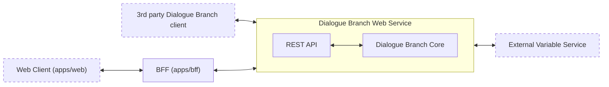
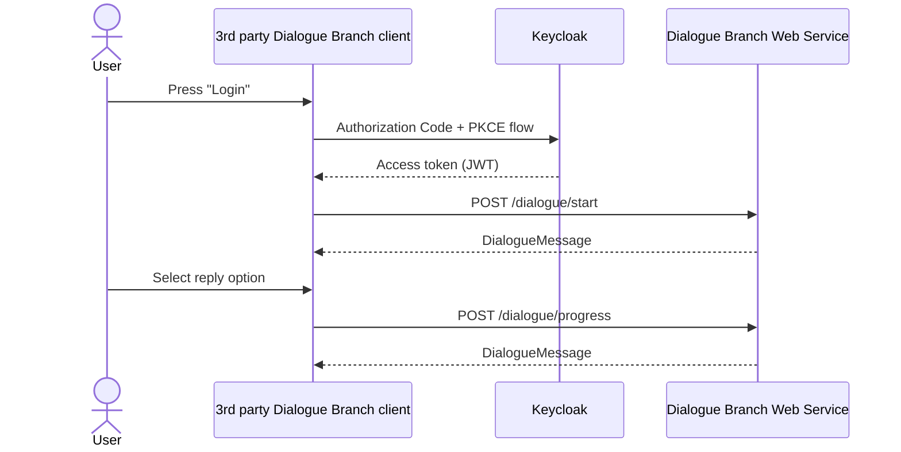

# Dialogue Branch Web Services Documentation

## Overview

The Dialogue Branch Web Service is a [JAVA Spring Boot Application](https://spring.io/projects/spring-boot) that can be deployed as a web service. It acts as a wrapper around the Dialogue Branch Core Library, offering an API that allows you to create client-server dialogue applications. A typical, simple architecture is shown in the Figure below.



*The overall Dialogue Branch Web Architecture. The Web Service acts as a REST API wrapper around the Dialogue Branch Core. A direct API client attaches its own Bearer token and talks to the Web Service directly; the bundled web client instead goes through the BFF, which never lets the browser hold a token (see [Authentication](/web-services/authentication)).*

The components described in the Architecture above are described as follows:

* **3rd party Dialogue Branch client** — Your own client application that connects to the Web Service directly, attaching its own OAuth2 Bearer token to every request, in order to render remotely executed Dialogue Branch dialogues.
* **Web Client (`apps/web`)** — The bundled Vue-based "Web Client Test Application" (WCTA) described below. Unlike a direct API client, it never holds a token itself; it authenticates and calls the Web Service through the BFF.
* **BFF (`apps/bff`)** — The Backend-for-Frontend that performs the OAuth2 login against Keycloak on behalf of the web client and proxies its API calls to the Web Service, keeping the access token server-side. See [Authentication](/web-services/authentication) for the full flow.
* **Dialogue Branch Web Service** — the Java Spring Boot Application that can be deployed in a web server. It is a pure [OAuth2](https://oauth.net/2/) resource server (user authentication itself is handled entirely by Keycloak, see [Authentication](#authentication)) and offers a REST API.
  * **REST API** — a set of REST end-points for executing DLB dialogues, managing DLB Variables, authoring and publishing dialogue content, and retrieving service info and logs.
  * **Dialogue Branch Core** — the "core" Java Library that contains the software for parsing and executing .dlb scripts. This is a collection of POJO's (Plain Old Java Objects) that can be embedded into any Java or Android application.
* **External Variable Service** — Your (optional) web service that may be used to provide just-in-time updates to DLB Variables.

Given the architecture above, a typical scenario for using Dialogue Branch in a client-server deployment is as follows. You deploy a DLB Web Service that has one or more [Dialogue Branch Projects](/language/dlb-project) loaded (initially seeded from disk, then managed in a database — see [Dialogue Branch Web Service Component](#dialogue-branch-web-service-component)). You then either write your own client application that connects to the DLB Web Service directly, or use (and adapt) the bundled web client, which connects through the BFF instead. Either way, users authenticate through Keycloak to start- and progress dialogues. If your .dlb dialogues include Variables that need to be updated from an external source, implement and deploy your own [External Variable Service](#external-variable-service) and connect this to your web service deployment.

## Dialogue Branch Web Service Component

The Dialogue Branch Web Service source code is part of this monorepo, in the [`apps/api`](https://github.com/dialoguebranch/platform/tree/main/apps/api) folder. A Vue 3 front-end that consumes this API — the "Web Client Test Application" (WCTA) — lives alongside it in [`apps/web`](https://github.com/dialoguebranch/platform/tree/main/apps/web).

The Gradle wrapper (`./gradlew`) in `apps/api` is used to build the service, which is packaged as a WAR file for deployment on [Tomcat 10](https://tomcat.apache.org/download-10.cgi), or built as a Docker image using the provided `Dockerfile` (built from the repository root, since the Docker build context spans both `apps/api/` and `packages/core/`). A detailed installation tutorial is provided here: [Dialogue Branch Web Service - Installation](/tutorials/webservice-installation).

Beyond executing published dialogues, the Web Service also hosts the API used by the visual dialogue editor in the web client:

* **Projects** (`/project/*`) — create, update, delete Dialogue Branch Projects and manage their translation languages.
* **Authoring** (`/authoring/*`) — CRUD operations on a project's editable *draft* dialogues, nodes and translations. Draft content is kept separate from published content, so authors can make in-progress changes without affecting what's currently live.
* **Publishing** (`/publish/*`) — validate and publish a project's current draft content as a new, immutable published version, available to the execution engine.
* **Draft execution** (`/draft/*`) — lets an author test-run a dialogue against its unpublished draft content, separate from the normal `/dialogue/*` execution path against published content.

After having successfully deployed the web service, you can start exploring its functionalities through the provided [Swagger](https://swagger.io/) pages (see image below).


*Screenshot of the provided Swagger pages for the Dialogue Branch Web Service.*

### Dialogue Execution

A typical workflow for a client application interacting with the Web Service is a follows:

1. Authenticate the user directly with Keycloak (Authorization Code + PKCE flow) to obtain an access token — see [Authentication](#authentication).
2. Include the access token in the header (`name`: `Authorization`, `value`: `Bearer <your-access-token>`) for all subsequent calls to the Web Service.
3. Start the execution of a dialogue, by calling the `/dialogue/start` end-point, providing `projectSlug`, `dialogueName`, `language` and `timeZone`.
4. Render the resulting JSON object (a `DialogueMessage`) as a dialogue user interface to the user, and store the `loggedDialogueId` and `loggedInteractionIndex`.
5. When the user selects a reply, call the `/dialogue/progress` end-point, providing the previously memorized `loggedDialogueId` and `loggedInteractionIndex`, as well as the selected `replyId`.
6. The result is a JSON object with the same structure as received in step 4, which can again be rendered, repeating the process.



*Sequence diagram for a typical User to Client to Server scenario of authenticating and executing dialogues with the Dialogue Branch Web Service*

The `/dialogue/*` end-points also support resuming an interrupted session (`/dialogue/continue`, `/dialogue/get-ongoing`), reverting to a previous step (`/dialogue/back`), explicitly ending a session (`/dialogue/cancel`), and (for users with the `editor` or `admin` role) listing all dialogues available in a project (`/dialogue/list-dialogues`). See the Swagger UI for the full set of parameters for each end-point.

### Working with Variables

Variables are used in .dlb scripts to create dynamic dialogue flow, and include flavourful personalisations. These Variables can be set and used inside the dialogue scripts themselves, as in the example below:

```text
<<set $playerName = "Bob">>

Hello $playerName, how are you doing?

[[I'm fine.|PlayerIsFine]]
[[I'm sad.|PlayerIsSad]]
```

However, as in the example, it doesn't always make sense to set the values for Variables in the dialogue scripts themselves. Instead, these values might originate from another part of your client application. Imagine that your client application is a game that includes a user interface where players can insert their name. When a player does this, the value should be communicated to Dialogue Branch, so that the $playerName variable may be used in dialogues.

The Web Service offers the following end-points for sending Variable-values to the service:

* `/variables/set-single` — allowing you to set the value for a single Variable by providing a `name` and a `value`.
* `/variables/set` — allowing you to set the value for a number of Variables simultaneously by including a JSON payload in the body.

Using these, you can inform Dialogue Branch about Variables whose values are generated through any part of your client application. The other way around, your client application can also ask the Web Service about Variable values, using the following end-point:

* `/variables/get` — allows you to ask for all known Variables for a user, or a space-separated list of specific Variables (via the `variableNames` parameter).

Another way of making sure that Dialogue Branch has up-to-date values for Variables, is by using an [External Variable Service](#external-variable-service), as explained below.

### Authentication

As explained in the [Dialogue Execution](#dialogue-execution) step, the first thing you need to do before working with the Web Service is to authenticate. See the [Authentication](/web-services/authentication) page for a full explanation.

In short: the Web Service is a pure OAuth2 resource server — it validates Bearer tokens issued by [Keycloak](https://www.keycloak.org/), but plays no role in issuing or refreshing them. Once authenticated, a user's Keycloak client roles (`participant`, `editor`, `admin`, on the `dlb-web-service` Keycloak client) determine what they may do:

* `participant` — may execute dialogues and read/write their own variables.
* `editor` — everything `participant` can do, plus authoring, publishing, and listing dialogues in a project.
* `admin` — everything `editor` can do, plus managing projects, and acting *on behalf of* another user via the optional `delegateUser` parameter present on most end-points.

This `delegateUser` mechanism may be used e.g. in a scenario where "clients" don't directly interact with the Dialogue Branch Web Service, but instead connect through a trusted web component that manages a single connection (see Figure below).


*The two modes of authentication. Left: multiple clients authenticate directly "as themselves" with the Web Service. Right: a trusted server component authenticates as an "admin" user, on behalf of multiple "delegateUsers".*

## External Variable Service

An External Variable Service is a web service that may be used by a Dialogue Branch Web Service deployment to act as an external source of information for Variable data. The Web Service itself keeps track of all Variables that are set for every individual user. For example, if a Variable is set in a dialogue using `<<set $variableName = "value">>` that value is stored. If your .dlb scripts only uses Variables that are set within the dialogue itself, the Web Service alone will handle everything.

However, if your dialogue contains a statement such as *The temperature outside is `$temperatureAtUserLocation` degrees.*, the value for `$temperatureAtUserLocation` is something that would likely need to be fetched from an external component - that is where the External Variable Service comes in.

Every time the Web Service starts executing a dialogue script, it collects a list of all the Variables used within that dialogue. The Web Service may (or may not) already have known values for these variables, but in any case, it will send a request to the External Variable Service to check whether any of the variables require updating. Your specific implementation of the External Variable Service needs to take care of these variable updates. For example, your variable service could in turn call a 3rd party weather API to retrieve the temperature at the user's location, and return this value to the Dialogue Branch Web Service.

This flow is outlined in the sequence diagram below:


*Sequence diagram for the flow of operations between a Client, the Dialogue Branch Web Service, an External Variable Service, and a 3rd Party API*

The External Variable Service integration is enabled through the following `dlb.external-variable-service.*` configuration properties (see `apps/api/src/main/resources/application.yml`, overridable via `DLB_EXTERNAL_VARIABLE_SERVICE_*` environment variables):

* `dlb.external-variable-service.enabled` — set to `true` to enable the integration; `false` (the default) disables it entirely.
* `dlb.external-variable-service.url` — the base URL where the external variable service can be reached.
* `dlb.external-variable-service.api-version` — the API version to use when calling the external variable service.
* `dlb.external-variable-service.api-key` — an API key used to authenticate the Web Service's calls to the external variable service.

::: info Note
It is worthwhile to make sure that the External Variable Service answers the request for variable updates quickly, because any delay will delay the starting of dialogue execution in the Dialogue Branch Web Service - which will negatively impact your end-user's experience. Apply caching, and make use of the provided `updatedTime` parameter that is passed along with each Variable, to make quick judgements whether a variable needs to be updated at all.
:::

::: info Note
If you found errors or have questions about this page, please consider reporting an issue at https://github.com/dialoguebranch/platform or sending an email to info@dialoguebranch.com.
:::
