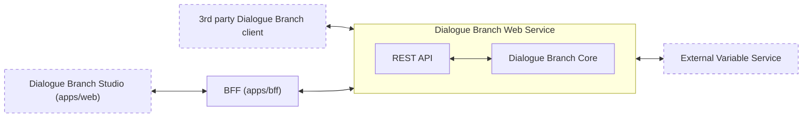

# Web Services: Overview

The Dialogue Branch Web Service is a [JAVA Spring Boot Application](https://spring.io/projects/spring-boot) that can be deployed as a web service. It acts as a wrapper around the Dialogue Branch Core Library, offering an API that allows you to create client-server dialogue applications. A typical, simple architecture is shown in the Figure below.

*The overall Dialogue Branch Web Architecture. The Web Service acts as a REST API wrapper around the Dialogue Branch Core. A direct API client attaches its own Bearer token and talks to the Web Service directly; Studio instead goes through the BFF, which never lets the browser hold a token.*

The components shown in the Figure above are each described on their own page:

* **[3rd Party Client Applications](/web-services/third-party-clients)** — Guidance for writing your own client application that connects to the Web Service directly, attaching its own OAuth2 Bearer token to every request, in order to render remotely executed Dialogue Branch dialogues.
* **[Dialogue Branch Studio](/web-services/studio)** (`apps/web`) — The bundled Vue-based dialogue authoring and testing application. Unlike a direct API client, it never holds a token itself; it authenticates and calls the Web Service through the BFF.
* **[BFF](/web-services/bff-service)** (`apps/bff`) — The Backend-for-Frontend that performs the OAuth2 login against Keycloak on behalf of Studio and proxies its API calls to the Web Service, keeping the access token server-side.
* **[Dialogue Branch Web Service](/web-services/api-service)** — the Java Spring Boot Application that can be deployed in a web server. It is a pure [OAuth2](https://oauth.net/2/) resource server (user authentication itself is handled entirely by Keycloak, see [Authentication](/web-services/authentication)) and offers a REST API.
  * **REST API** — a set of REST end-points for executing DLB dialogues, managing DLB Variables, authoring and publishing dialogue content, and retrieving service info and logs.
  * **Dialogue Branch Core** — the "core" Java Library that contains the software for parsing and executing .dlb scripts. This is a collection of POJO's (Plain Old Java Objects) that can be embedded into any Java or Android application.
* **[External Variable Service](/web-services/external-variable-service)** — Your (optional) web service that may be used to provide just-in-time updates to DLB Variables.

Given the architecture above, a typical scenario for using Dialogue Branch in a client-server deployment is as follows. You deploy a DLB Web Service that has one or more [Dialogue Branch Projects](/language/dlb-project) loaded (initially seeded from disk, then managed in a database — see the [API Service](/web-services/api-service) page). You then either write your own client application that connects to the DLB Web Service directly, or use (and adapt) Studio, the bundled web client, which connects through the BFF instead. Either way, users authenticate through Keycloak to start- and progress dialogues — see [Authentication](/web-services/authentication) for how that works for each kind of client. If your .dlb dialogues include Variables that need to be updated from an external source, implement and deploy your own [External Variable Service](/web-services/external-variable-service) and connect this to your web service deployment.

::: info Note
Development of the Dialogue Branch Platform (including the Web Service) occurs on the [main](https://github.com/dialoguebranch/platform/tree/main) branch of the monorepo. For stable software versions, check out the [release tags](https://github.com/dialoguebranch/platform/releases).
:::

::: info Note
If you found errors or have questions about this page, please consider reporting an issue at https://github.com/dialoguebranch/platform or sending an email to info@dialoguebranch.com.
:::
