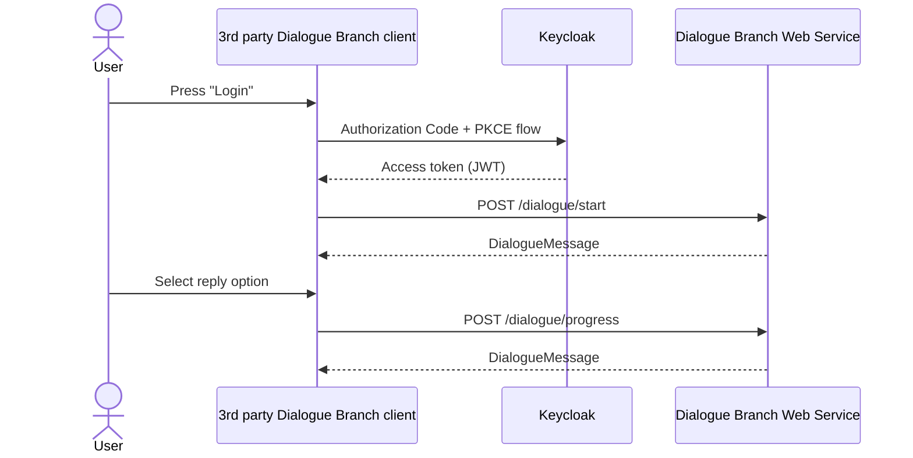

# Web Services: 3rd Party Clients

Your own client application can connect to the Dialogue Branch Web Service directly, without going through the [BFF](/web-services/bff-service) used by [Dialogue Branch Studio](/web-services/studio). This page walks through a typical workflow for such a "direct API client".

## Authenticating

Authenticate the user directly with Keycloak, using the Authorization Code + PKCE flow, to obtain an access token, then include it in the header (`name`: `Authorization`, `value`: `Bearer <your-access-token>`) for all subsequent calls to the Web Service. See [Direct API Clients](/web-services/authentication#direct-api-clients) for the full explanation.

## Dialogue Execution

A typical workflow for a client application interacting with the Web Service is a follows:

1. Authenticate the user directly with Keycloak (Authorization Code + PKCE flow) to obtain an access token — see [Authentication](/web-services/authentication).
2. Include the access token in the header (`name`: `Authorization`, `value`: `Bearer <your-access-token>`) for all subsequent calls to the Web Service.
3. Start the execution of a dialogue, by calling the `/dialogue/start` end-point, providing `projectSlug`, `dialogueName`, `language` and `timeZone`.
4. Render the resulting JSON object (a `DialogueMessage`) as a dialogue user interface to the user, and store the `loggedDialogueId` and `loggedInteractionIndex`.
5. When the user selects a reply, call the `/dialogue/progress` end-point, providing the previously memorized `loggedDialogueId` and `loggedInteractionIndex`, as well as the selected `replyId`.
6. The result is a JSON object with the same structure as received in step 4, which can again be rendered, repeating the process.

*Sequence diagram for a typical User to Client to Server scenario of authenticating and executing dialogues with the Dialogue Branch Web Service*

The `/dialogue/*` end-points also support resuming an interrupted session (`/dialogue/continue`, `/dialogue/get-ongoing`), reverting to a previous step (`/dialogue/back`), explicitly ending a session (`/dialogue/cancel`), and (for users with the `editor` or `admin` role) listing all dialogues available in a project (`/dialogue/list-dialogues`). See the Swagger UI for the full set of parameters for each end-point.

## Working with Variables

Your client can set and retrieve Dialogue Branch Variables via the `/variables/*` end-points — see [Working with Variables](/web-services/api-service#working-with-variables) on the API Service page.

## Acting on Behalf of Other Users

If your "client" is actually a trusted server-side component managing many end-users through a single connection (rather than each end-user authenticating individually), see the `delegateUser` mechanism described under [Roles](/web-services/authentication#roles) on the Authentication page.

::: info Note
If you found errors or have questions about this page, please consider reporting an issue at https://github.com/dialoguebranch/platform or sending an email to info@dialoguebranch.com.
:::
